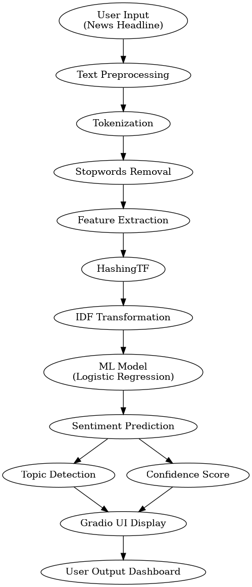
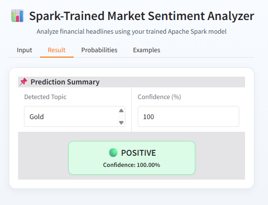
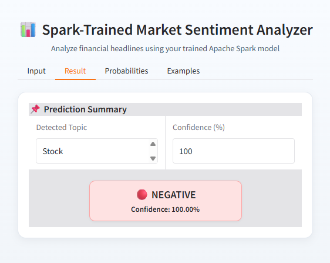
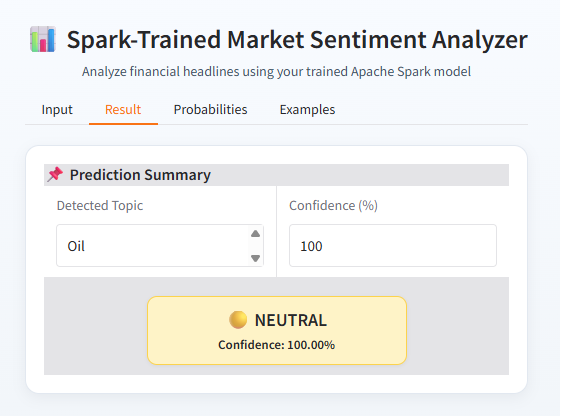

# Real-Time Market Sentiment Analyzer using Apache Spark

## 🚀 Project Overview
This project is a **Scalable Sentiment Analysis System** built using **Apache Spark MLlib** to analyze financial news headlines and classify them into **Positive, Negative, or Neutral sentiments**.

It combines:
- ⚡ Distributed Computing (Apache Spark)
- 🧠 Machine Learning (Logistic Regression)
- 📈 Financial Domain Knowledge
- 🌐 Interactive UI (Gradio)

---

## 🎯 Objective
- To build a **scalable sentiment analysis system** for financial news
- To handle **large-scale data using Spark**
- To improve prediction quality using **class imbalance handling**
- To provide a **real-time prediction interface**

---

## 🧰 Tools Used

| Category              | Tools / Technologies |
|----------------------|--------------------|
| Programming Language | Python 🐍 |
| Big Data Framework   | Apache Spark 🔥 |
| ML Library           | PySpark MLlib |
| Data Processing      | Pandas |
| UI Framework         | Gradio |
| Visualization        | Built-in UI components |
| Development Platform | Google Colab / Jupyter Notebook |
| Version Control      | Git & GitHub |

---

## 🧠 Techniques Used

### 1. Distributed Text Processing
- Tokenization of headlines
- Stopword removal
- Feature extraction using Spark pipelines

### 2. Feature Engineering
- **HashingTF** for converting text into numerical vectors
- **IDF (Inverse Document Frequency)** for weighting important words

### 3. Machine Learning Model
- **Logistic Regression Classifier**
- Handles multi-class sentiment classification

### 4. Class Imbalance Handling
- Implemented **class weights**
- Improves prediction accuracy for underrepresented classes

---

## 🏗️ System Architecture

  

**Figure 1: System Architecture**

---
## 📊 Results & Output

The system was tested on multiple real-world financial news headlines to evaluate its performance. The model successfully classified sentiments into **Positive, Negative, and Neutral** categories with high confidence.

---

### 🟢 Positive Sentiment Example

**Input:**
> Gold prices rise as investors seek safe haven  

**Output:**
- Detected Topic: Gold  
- Sentiment: Positive  
- Confidence: 100%  

---

### 🔴 Negative Sentiment Example

**Input:**
> Stock market crashes amid inflation fears  

**Output:**
- Detected Topic: Stock  
- Sentiment: Negative  
- Confidence: 100%  

---

### 🟡 Neutral Sentiment Example

**Input:**
> Oil prices remain stable in global trade session  

**Output:**
- Detected Topic: Oil  
- Sentiment: Neutral  
- Confidence: 100%  

---

## 📌 Observations

- The model correctly identifies **financial keywords** such as:
  - Gold → Commodity Market
  - Stock → Equity Market
  - Oil → Energy Market  

- Sentiment classification aligns well with:
  - Positive → Growth / Rise / Surge  
  - Negative → Crash / Decline / Weakness  
  - Neutral → Stability / No major movement  

- The system provides:
  - 📌 Topic detection  
  - 📊 Confidence score  
  - 🎯 Accurate sentiment classification  

---

## 🧠 Conclusion from Results

The results demonstrate that the system is capable of:
- Performing **real-time sentiment analysis**
- Handling **financial domain-specific text**
- Delivering **high-confidence predictions**

This validates the effectiveness of:
- Apache Spark ML pipeline  
- Feature engineering techniques  
- Class-weighted Logistic Regression

